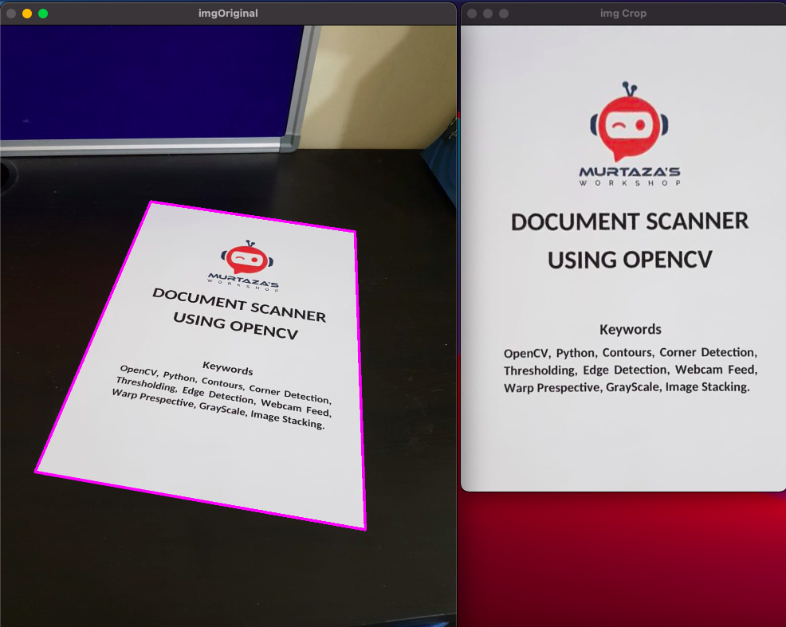

# openCV_scannerAndDetector

### It is a Practice repo for following opencv Tutorial.

### https://www.youtube.com/watch?v=2FYm3GOonhk&t=10979s

### SCANNER DEMO RESULT.

ORIGINAL IMAGE VS AFTER WARP IMG PROCESS.

